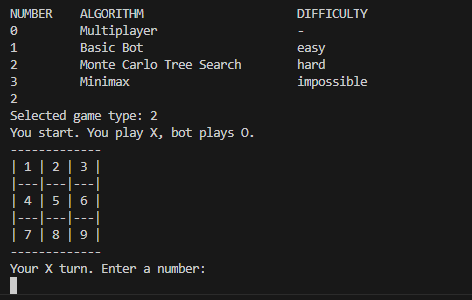

# Rust Tic Tac Toe AI
A command-line (unbeatable) Tic Tac Toe AI game implemented in Rust. This project offers multiple game play modes, including AI algorithms like Minimax and Monte Carlo Tree Search (MCTS).

## Table of Contents

| Section                         | Description |
|---------------------------------|-------------|
| [Features](#features)           | Overview of game modes and AI |
| [Installation](#installation)   | How to install and run the game |
| [Game Modes](#game-modes)       | Explanation of different game modes |
| [AI Algorithms](#ai-algorithms) | Summary of Minimax & MCTS |
| [Gallery](#gallery)             | Screenshot of the game |
| [Resources](#resources)         | Useful links for AI learning |
| [Contact](#contact)             | Get in touch with the developer |

## Features
- ✔ **Multiplayer**: Play against another human.
- ✔ **Basic Bot**: Bot plays immediate wins.
- ✔ **Minimax AI**: Uses the Minimax algorithm to play optimally.
- ✔ **MCTS AI**: Uses Monte Carlo Tree Search for decision-making.

## Installation 🚀
Clone the repository and build the project:

```sh
git clone https://github.com/0xTijan/tic-tac-toe-ai.git
cd tic-tac-toe-ai
cargo build
```

Run the game:

```sh
cargo run
```

## Game Modes 🎮

### 1. Multiplayer
Two players take turns on the same terminal.

### 2. Basic Bot
The bot takes opportunities for immediate wins and blocks the opponent's immediate wins; otherwise, it plays randomly.

### 3. Minimax AI
A strategy-based AI that always plays optimally by evaluating the best possible move using the Minimax algorithm.

### 4. Monte Carlo Tree Search (MCTS) AI
An AI that uses Monte Carlo simulations to determine the best move. It balances exploration and exploitation to refine its strategy.


## AI Algorithms

### Minimax
The **Minimax algorithm** evaluates all possible moves, selecting the one that maximizes the AI’s chance of winning while minimizing the opponent’s best options. It guarantees perfect play but can be computationally expensive.

👉 Full explanation in [./minimax.md](minimax.md).

### Monte Carlo Tree Search (MCTS)
Unlike Minimax, **MCTS uses simulations** to statistically determine the best move, making it effective for large game spaces.

👉 Full breakdown in [./mcts.md](mcts.md).

## Gallery


## Resources
- [MCTS Visualization](https://vgarciasc.github.io/mcts-viz/) - great for debugging
- [MCTS explanation (YouTube)](https://www.youtube.com/watch?v=UXW2yZndl7U)

## Contact
For questions or suggestions, reach out via GitHub or email at [tijan@tijan.dev](mailto:tijan@tijan.dev) or visit [my website](https://tijan.dev/).